# Madras ビルドガイド

このビルドガイドに一度目を通してから組み立てはじめてください。

- [Madras ビルドガイド](#madras-ビルドガイド)
  - [免責事項](#免責事項)
  - [1. BOM を確認する](#1-bom-を確認する)
    - [Madras キットに含まれるもの](#madras-キットに含まれるもの)
    - [Madras キットに含まれないもの](#madras-キットに含まれないもの)
      - [対応スイッチについて](#対応スイッチについて)
  - [2. はんだづけ](#2-はんだづけ)
    - [ツェナーダイオード(D38,D39)](#ツェナーダイオードd38d39)
    - [ダイオード(D1-D37, D40)](#ダイオードd1-d37-d40)
    - [抵抗(R)](#抵抗r)
      - [抵抗値のリスト](#抵抗値のリスト)
      - [Rev 1 基板の場合](#rev-1-基板の場合)
    - [クリスタル(Y1)](#クリスタルy1)
    - [USB コネクタ](#usb-コネクタ)
    - [コンデンサ(C2,C3,C4,C5)](#コンデンサc2c3c4c5)
    - [IC ソケット](#ic-ソケット)
    - [LED(D41, D42)](#ledd41-d42)
    - [MOSFET(Q1)](#mosfetq1)
    - [タクトスイッチ](#タクトスイッチ)
    - [電解コンデンサ(C1)](#電解コンデンサc1)
    - [ポリフューズ](#ポリフューズ)
    - [MCU の取り付け](#mcu-の取り付け)
  - [動作確認](#動作確認)
    - [PC と接続する前に](#pc-と接続する前に)
    - [PC と接続する](#pc-と接続する)
  - [Bootloader と Firmware](#bootloader-と-firmware)
  - [vial での動作確認](#vial-での動作確認)
  - [トラブルシューティング](#トラブルシューティング)
    - [PC と接続したときに正しく認識されない](#pc-と接続したときに正しく認識されない)
    - [キー入力がおかしい](#キー入力がおかしい)
  - [スイッチとリレーのはんだづけ](#スイッチとリレーのはんだづけ)
  - [リレーの動作確認](#リレーの動作確認)
  - [アクリルカバーとボトムプレートの取り付け](#アクリルカバーとボトムプレートの取り付け)
  - [完成](#完成)

## 免責事項

- Madras ははんだづけが必要な組み立てキットです。動作するまでなるべくお手伝いはしますが、完全動作をお約束するものではありません。
- 組み立て中・組み立て後・使用時に起こった問題、事故、怪我などの補償は出来ません。
- 部品の不足や不備はなるべく組み立て前にご連絡ください。組み立て後、組み立て中の場合、対応できない可能性があります。

## 1. BOM を確認する

Madras キットには以下の部品が必要です。  
組み立て始める前に不足がないかどうか確認してください。  
不足があった場合は、組み立て前に info[at]5z6p.com か、SNS で@hsgw までご連絡ください。

### Madras キットに含まれるもの

| Reference   | Value              | Qty |
| ----------- | ------------------ | --- |
| C1          | 10u                | 1   |
| C2,C3       | 22p                | 2   |
| C4,C5       | 100n               | 2   |
| D1-37,D40   | 1N4148             | 38  |
| D38,D39     | 3.6V               | 2   |
| D41         | 3mm                | 1   |
| D42         | 3mm                | 1   |
| F1          | 100mA              | 1   |
| J1          | USB_C_Receptacle   | 1   |
| Q1          | BS170              | 1   |
| R1,R2,R6    | 5k1                | 3   |
| R3,R7,R8    | 1k5                | 3   |
| R4,R5       | 75R                | 2   |
| R9          | 300R               | 1   |
| R10         | 47k                | 1   |
| RL1         | G2R-2-DC5          | 1   |
| SW38, SW39  | Tactile Switch     | 2   |
| U1          | ATMEGA328P-PU      | 1   |
| U1          | IC socket          | 1   |
| Y1          | 16MHz              | 1   |
| Screw       | M2 8mm             | 4   |
| Screw       | M2 20mm            | 1   |
| Screw       | M2 16mm            | 3   |
| Screw       | M2 nut             | 18  |
| Spacer      | M2 10mm(no thread) | 4   |
| Cover       | Acrylic cover      | 1   |
| rubber feet |                    | 4   |
| PCB         | Main, Bottom PCB   | 2   |

### Madras キットに含まれないもの

| Reference   | Value                                   | Qty |
| ----------- | --------------------------------------- | --- |
| SW1-37,SW40 | Cherry MX compatible(PCB Mount)         | 38  |
| STAB        | Cherry MX Stabilizers (2Ux2 or 6.25Ux1) | 1   |
| Cable       | USB Type-C cable                        | 1   |

#### 対応スイッチについて

Cherry MX 互換スイッチであればどれでも使用できますが、プレートレス構造のため`PCB Mount(スイッチに2本、固定するための樹脂足が出ているもの)`をおすすめします。  
Plate Mount のもの(Kailh box や Kailh island など)は綺麗にまっすぐ並べるのが難しいです。

## 2. はんだづけ

部品を基板にはんだづけしていきます。

- 基本的に**背の低い順**にとりつけるように進めます。
- **極性(部品の向き)** が決まっている部品があります。
- 部品は種類や値ごとに作業する分だけ取り出すと間違いを減らせます。
- スイッチとリレーは動作確認後にはんだづけします。

### ツェナーダイオード(D38,D39)

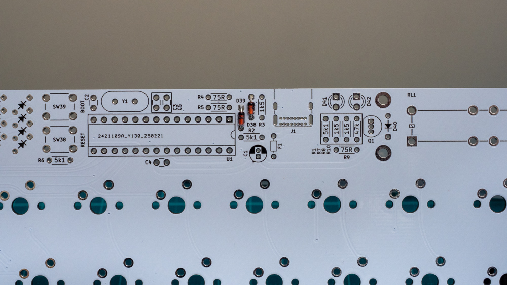

ツェナーダイオード(D38,D39)をはんだづけします。  
2 本だけ別に入っているダイオードがツェナーダイオードです。  
部品表面に`3.6`とプリントされています。

**ダイオードには極性があります**  
ダイオードの黒い帯がある方がカソードです。(PCB の四角いパッド側)

### ダイオード(D1-D37, D40)

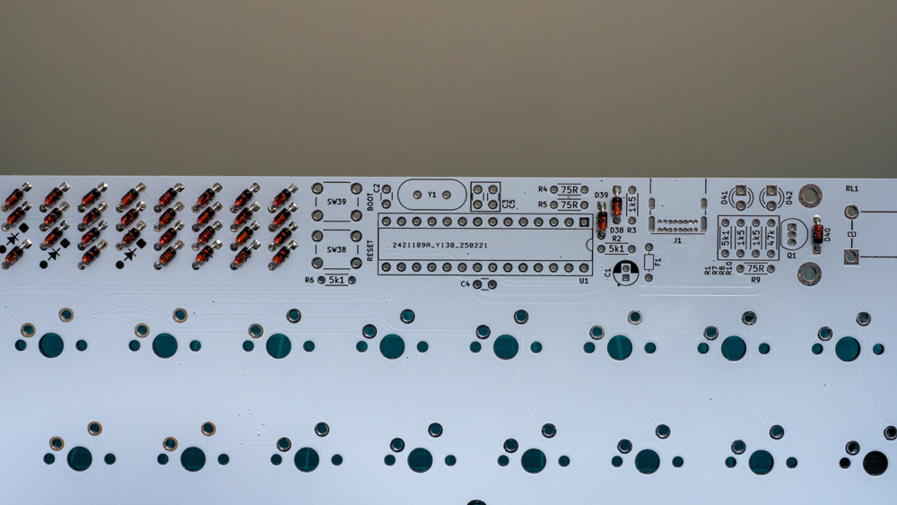

ダイオード(D1-D37, **D40**)をはんだづけします。  
D40 だけ離れた場所にあるので忘れずに。

**ダイオードには極性があります**  
ダイオードの黒い帯がある方がカソードです。(PCB の四角いパッド側)

### 抵抗(R)

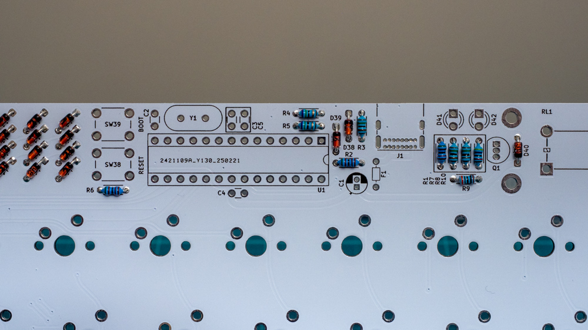

抵抗をはんだづけします。  
基板上に表記されている値を確認しながらはんだづけします。  
抵抗値はカラーコードを読み取るか、マルチメーターで測定してください。

#### 抵抗値のリスト

| 抵抗値 | 個数 | Ref      |
| ------ | ---- | -------- |
| 5.1k   | 3    | R1,R2,R6 |
| 1.5k   | 3    | R3,R7,R8 |
| 75     | 2    | R4,R5    |
| 300    | 1    | R9       |
| 47k    | 1    | R10      |

#### Rev 1 基板の場合

`R9`に`75R`と表記されていますが、`300Ω`の抵抗をはんだづけしてください。

### クリスタル(Y1)

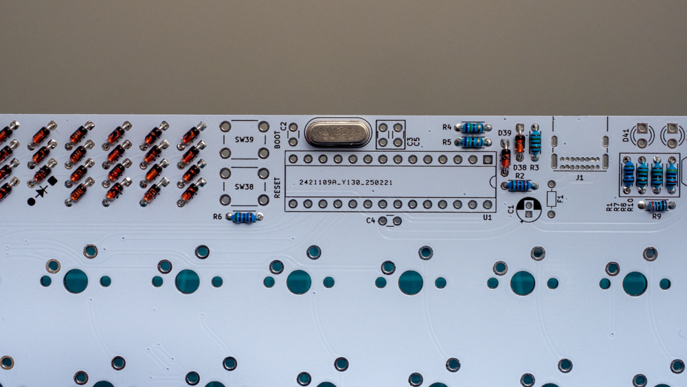

クリスタルをはんだづけします。

### USB コネクタ

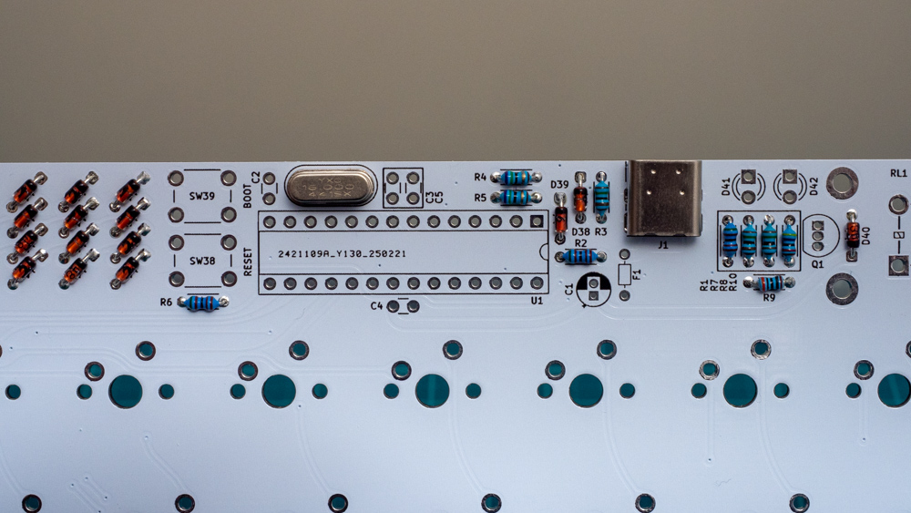

**!! 最大の難関ポイントです !!**

- はんだづけする足が基板裏側にギリギリ出る程度の長さしかありません。  
  フラックスを使用しながら、慎重に足とパッドを温めてはんだづけします。
- パッドの間隔がとても狭いです。  
  一旦ブリッジさせたあと、ハンダ吸い取り線で修正しても良いです。

### コンデンサ(C2,C3,C4,C5)

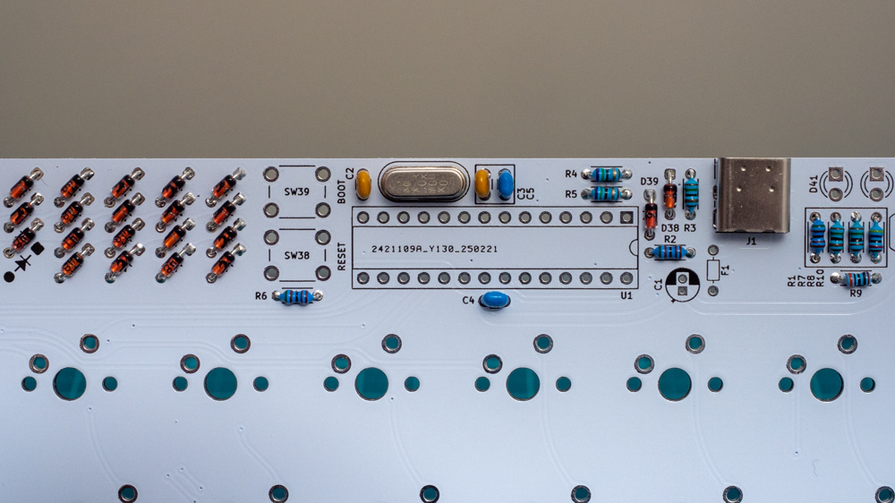

C2,C3 は`22pF`、C4,C5 は`100nF(0.1uF)` です。
部品のマーキングを確認するか、マルチメーターで確認してください。

### IC ソケット

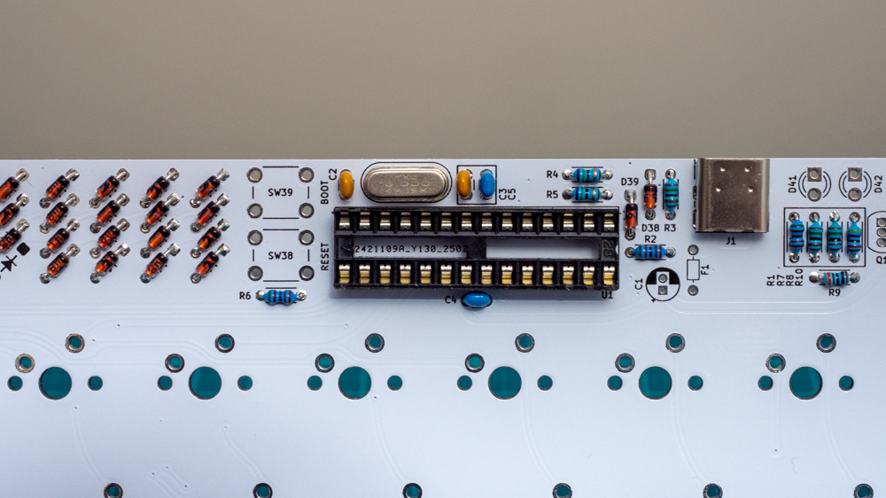

**IC ソケットには向きがあります**  
基板上のシルクの半円と IC ソケットの切掛けをあわせた向きで取り付けてください。  
(電気的には反対でも特に問題ないです)

### LED(D41, D42)

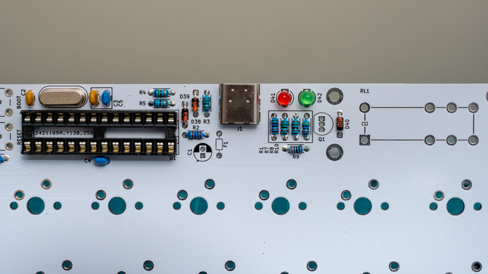

LED をはんだづけします。色はどちらでも構いません。

**LED には極性があります**  
短い足の方がカソードです。(PCB の四角いパッドの方)

### MOSFET(Q1)

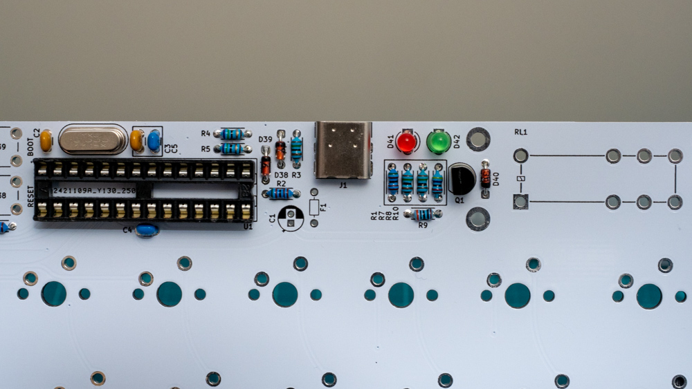

MOSFET をはんだづけします。  
基板上のシルクと部品の形をあわせてはんだづけしてください。  
パッド間のピッチが狭いのでブリッジに注意。

### タクトスイッチ

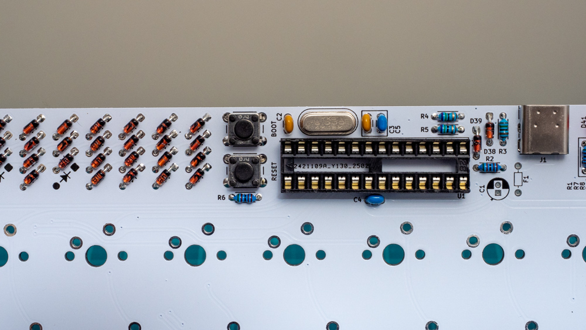

タクトスイッチをはんだづけします。

### 電解コンデンサ(C1)

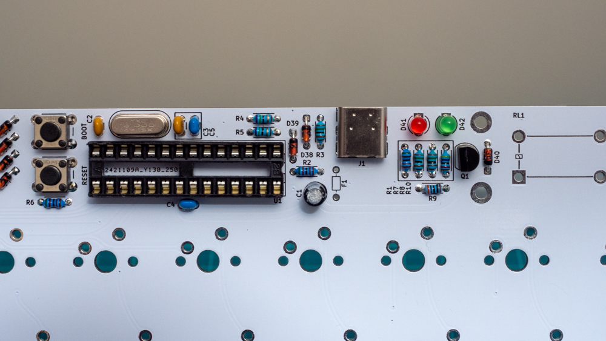

電解コンデンサをはんだづけします。

**電解コンデンサには向きがあります**  
短い足の方がカソードです。(PCB の四角いパッドの方)

### ポリフューズ

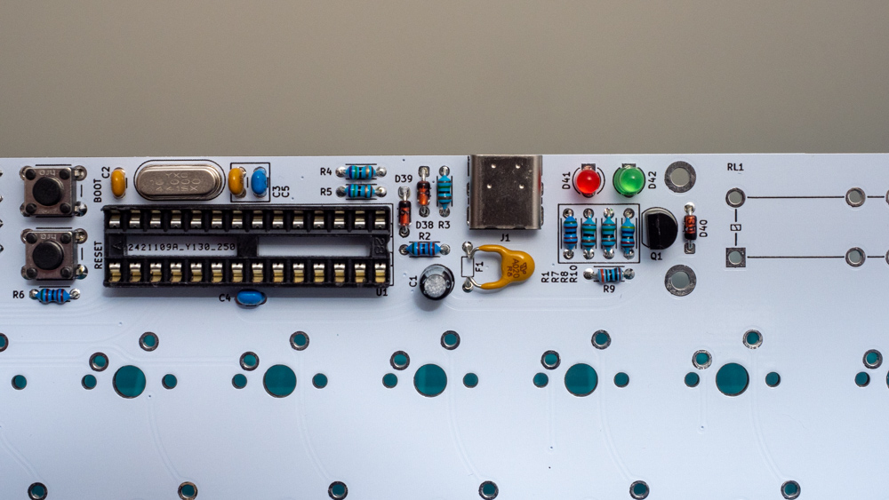

はんだづけしたあと慎重に折り曲げます。  
基板や部品に当たらない程度に曲げてください。

### MCU の取り付け

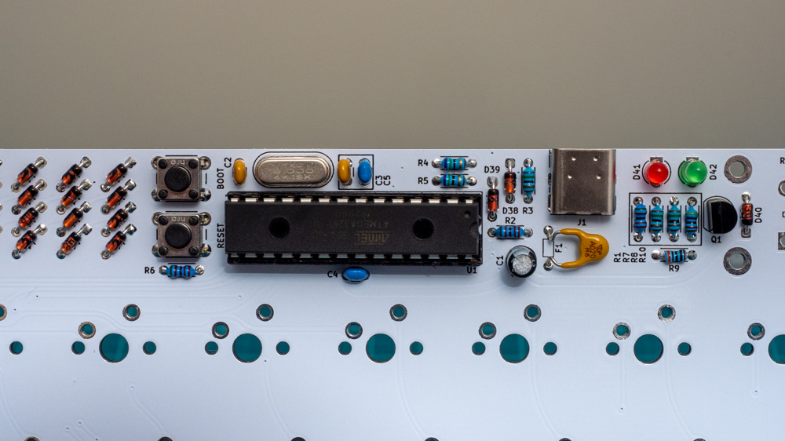

MCU(マイコン IC)をソケットに取り付けます。
足が開いているので机などまっすぐなものに押し当ててピンを整えて、真上から差し込んでください。

**MCU には極性があります**  
ソケットの切掛けと部品の切掛けをあわせます。

## 動作確認

スイッチとリレーをはんだづけする前に動作確認をします。

### PC と接続する前に

USB ケーブルで PC と接続する前に**かならず**以下の点をチェックしてください。

- マイコンの向きが正しいか
- 電源がショートしていないか  
  電源のショートは C4(もしくは C5)の両端が導通していないことを確認します

### PC と接続する

- PC と接続したときに正しく認識されるかどうか  
  デバイスマネージャなどで madras が見えるかどうか確認する

## Bootloader と Firmware

**キットを購入した場合は bootloader, firmware は書き込み済みです**

- bootloader を書き込む  
  MCU に bootloader を書き込みます。書き込み用端子は基板上にないので別途取り外してブレッドボードなどで書き込んでください。
- firmware を書き込む  
  QMK Toolbox を使ってファームウェアを書き込みます

bootloader と firmware については[こちら](firmware/)

## vial での動作確認

デフォルトファームウェアは[vial](https://get.vial.today/)に対応しています。

- vial の matrix tester を使ってスイッチの動作を確認する
  1. [vial](https://get.vial.today/)にアクセスして、madras を認識させます。
  2. 正しく認識されたら`Matrix tester`のタブを開く
  3. スイッチのパッドを導線や金属製のピンセットでショートさせて全てのキーが正しく認識されるか確認する

## トラブルシューティング

### PC と接続したときに正しく認識されない

- USB ハブを使っている場合は直接 PC に接続する
- USB コネクタのはんだづけを確認する
- ツェナーダイオードや MCU の向きを確認する
- MCU が正しくソケットに差し込まれているか確認する
- PC とケーブルを変えてみる

### キー入力がおかしい

- ダイオードのはんだづけ・向きを確認する
- MCU が正しくソケットに差し込まれているか確認する

## スイッチとリレーのはんだづけ

スイッチとリレーをはんだづけします。  
スイッチはプレートレス構造のためそのまま基板に差し込んで取り付けてください。  
選択したレイアウトによって、最下段のスイッチははんだづけする箇所が違います。

## リレーの動作確認

デフォルトでリレーを使ったハプティックフィードバックはオンになっています。(D42 の LED が点灯)  
オフになっている場合は、デフォルトキーマップならレイヤー 1 の以下のキーを押してください。  
キーをカスタマイズしている場合は、`Quantum`→`Haptic Toggle` か `Haptic On` を設定してそのキーを押してください。

## アクリルカバーとボトムプレートの取り付け

使用するネジの組み合わせは以下の 3 種類です。

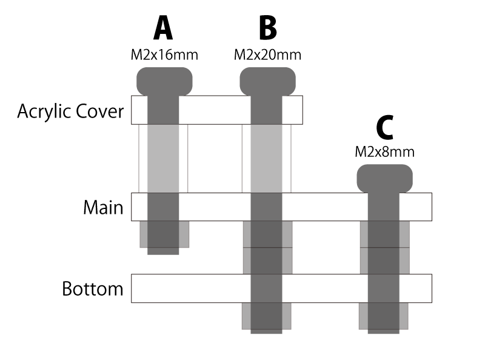
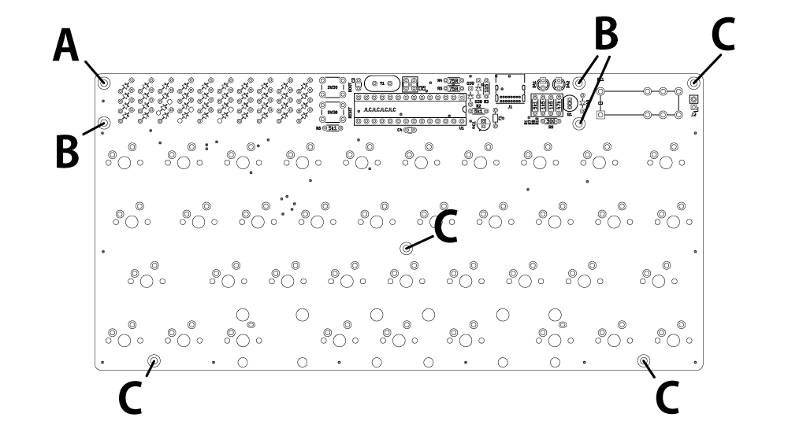

1. アクリルカバーの保護紙をはがす
2. アクリルカバーと Main PCB をねじ止めする
3. Bottom PCB をねじ止めする
4. ゴム足を Bottom PCB の 4 隅に貼りつける

## 完成

キーキャップを取り付けたら完成です。  
SNS で自慢してください！
