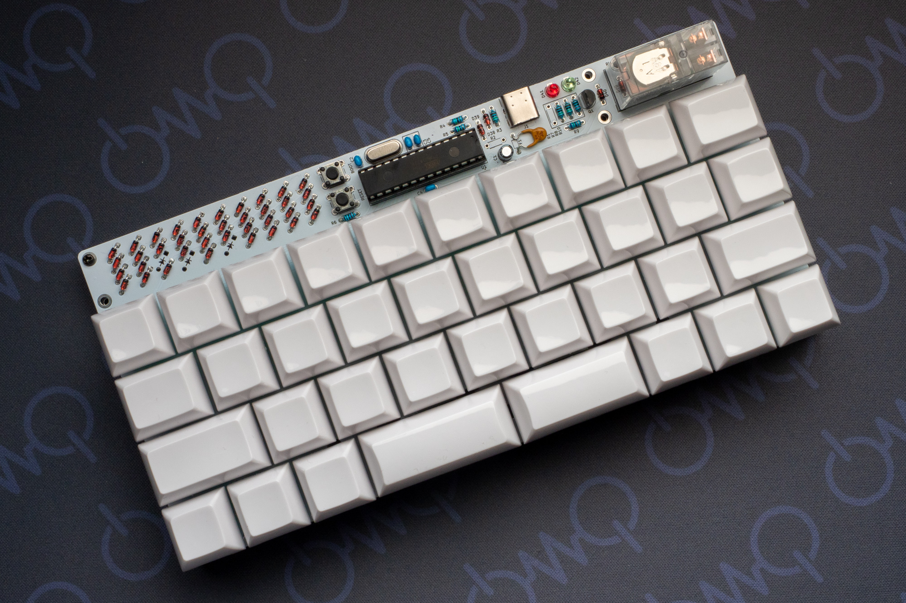

# Madras

Madras is a keyboard kit made by through hole components with QAZ layout.  
More information at https://5z6p.com/products/madras/

マドラスはスルーホール部品だけで作られた QAZ レイアウトのキーボードキットです。  
詳しくは https://5z6p.com/products/madras/

## Build Guide

日本語でのビルドガイドは[こちら](build_guide_jp.md)

(TODO) English

## License

See [LICENSE](LICENSE).  
(c) 2025, Takuya Urakawa(@hsgw), 5z6p Instruments, Dm9 Records
